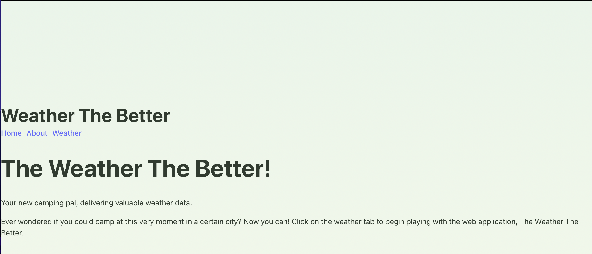
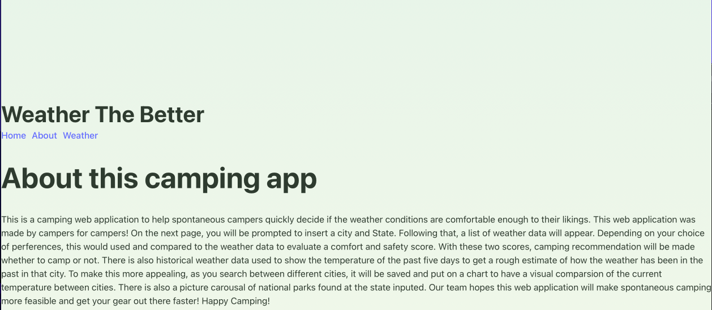
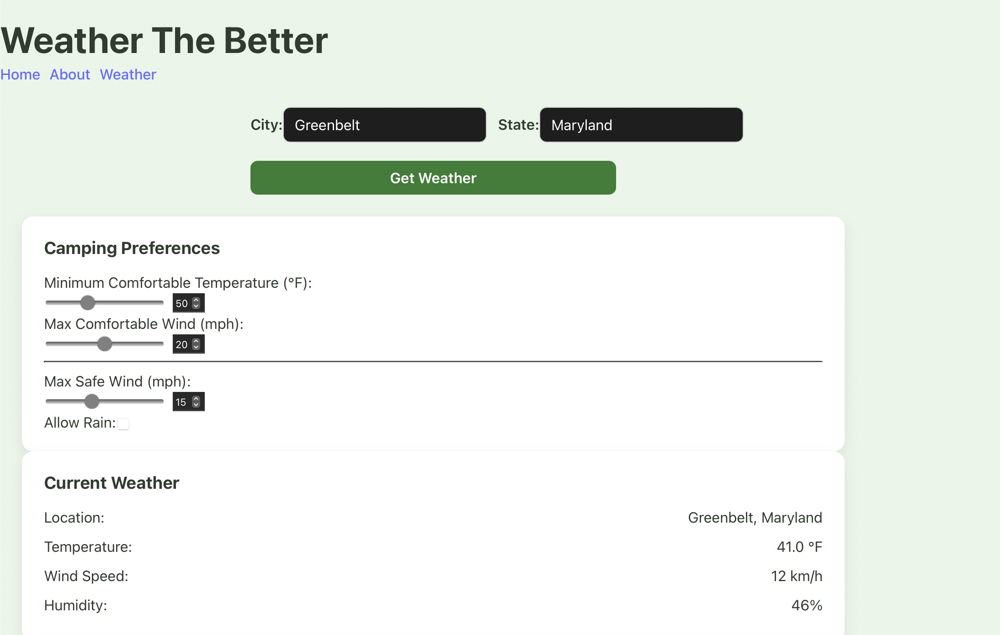
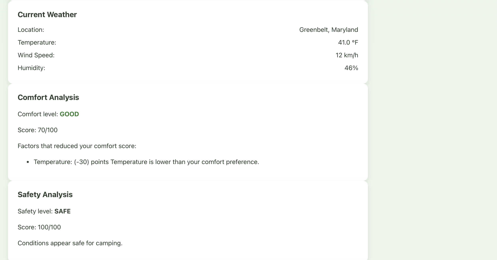
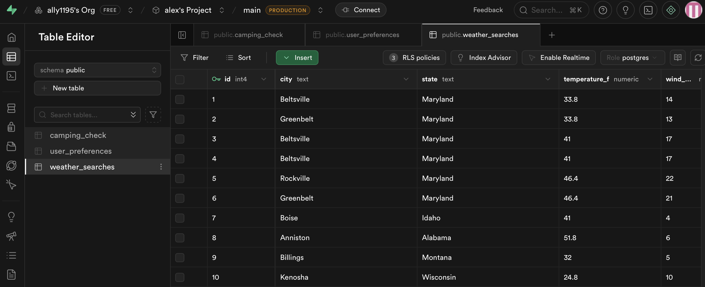
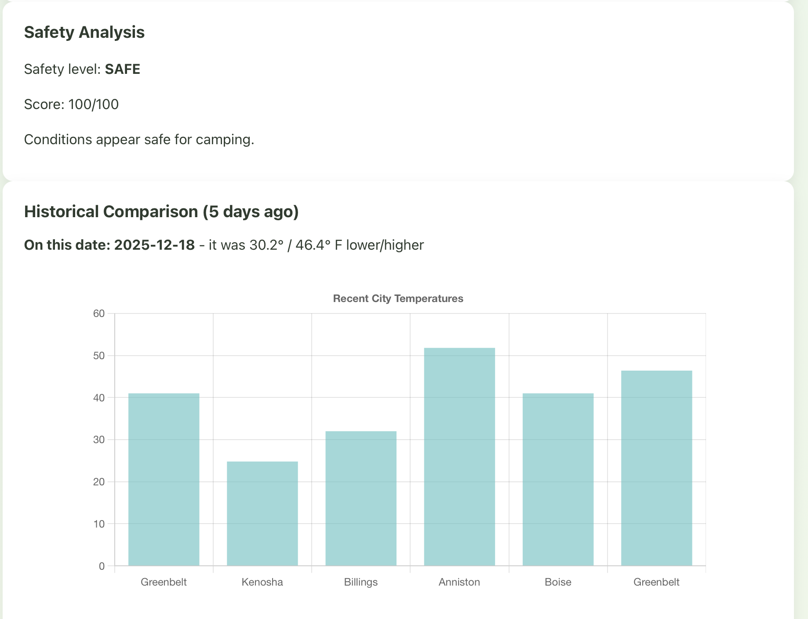
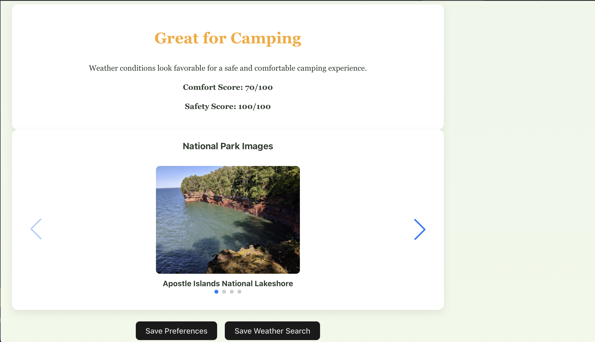

# Title: Weather The Better

## Description of the project

This is a camping web application to help spontaneous campers quickly decide if the weather conditions are comfortable enough to their likings. This web application was made by campers for campers!

APIs Used:

- Weatherstack
- National Parks Service (nps)

Database used:

- Supabase

Js Libraries:

- React
- Chart.js
- Swiper.js

Fetch Calls:

- Weatherstack - current
- Weatherstack - historical
- National Parks Service - parks

### What this application does:

First, it takes a user input for a specific city and state and searches different weather metrics such as wind speed or temperature. From there, the application will search through weatherstack's current and historic api endpoints to gather weather data for the user. The weather data will be displayed for the user to read and understand. Once the data is pulled from the api and displayed, there are different cards for the user to read. The initial card will be a camping preferences card that allows the user to adjust different metrics that would affect the comfort and safety analysis score. These scores dynamically change as the metrics change from the user and is compared to the weather data.

Once a city is search, and camping preferences have been placed, a comfort and safety analysis score is made. Using both the comfort and safety analysis scores along with the user's camping preferences, a camping recommendation is provided.

To help campers decide which city is the best to camp in, there is a chart that compares the last five searches as each search is saved in a supabase database as long as the entries are being saved with the "save weather preferences" button.

Lastly to make it more fun, At the bottom of the page, the national parks service api is linked to the state/region being search. So after the (city, state) has been searched, there will be a photo carousal of five national parks found in the state.

The goal of this application, is to be a useful tool that provides useful weather data streamlined in a manner that helps campers decide if they want to camp that very day.

## Target browsers: (iOS, Andriod, Windows, Mac, Safari, Chrome, Mozilla)

[Link to Developer Manual](#developer-manual)

## Developer Manual

### How to install the application and all dependencies:

1. Make sure you are in the root directory
2. Run `npm i` or `npm install` to grab the dependencies from the [package.json]

### How to run any tests you have written for your software

No unit tests were written for this project. But if a developer did want to create tests, even better! [Jest](https://jestjs.io/) is a power testing framework for Javascript and would work well for this application.

### The API for your server application - all GET, POST, PATCH, etc endpoints, and what they each do

- Call: Weatherstack - current

  - Type of Request: Get Request
  - Endpoint: `https://api.weatherstack.com/current?access_key=${apiKey}&query=${encodeURIComponent(location)}`

    - Parameters

      - access_key: Api Access Key
      - query: param to pass a single location to the API

    - link to endpoint in codebase: [here](../src/pages/WeatherPage.tsx#L58)

  - What does it do: The endpoint will query the weatherstack API for real-time weather data in a location of your choice

- Call: Weatherstack - historical

  - Type of Request: Get Request
  - Endpoint: `https://api.weatherstack.com/historical?access_key=${apiKey}&query=${encodeURIComponent(
  location
)}&historical_date=${historicalDate}`
  - link to endpoint in codebase: [here](../src/pages/WeatherPage.tsx#L72)
  - Parameters

    - access_key: Api Access Key
    - query: param to pass a single location to the API
    - historical_date: pass one historical date or multiple semicolon-separated dates to the API

  - What does it do: This endpoint will look up historical weather data all the way back to 2015, simply pass one date of your choice (later than July 2008) or multiple semicolon-separated dates.

- Call: National Parks Service - parks

  - Type of Request: Get Request
  - Endpoint: `https://developer.nps.gov/api/v1/parks?q=${encodeURIComponent(location)}&api_key=${npsKey}`
  - link to endpoint in codebase: [here](../src/pages/WeatherPage.tsx#L83)
    - Parameters:
      - q: param to pass a single location to the API
      - api_Key: Api Access Key
  - What does it do: Pulls park images data

  ## Known Bugs + Future Development

  ### Known Bugs

  1. Camping preferences are not completely aligned with the comfort and safety analysis. While they are working and functional, they can be advanced for better recommendations.

  2. Park images have to adjusted to fit in one exact css container.

  ### Future Development

  1. Right now, the appliction only supports cities and state by their full name. It cannot support the acronym of the state (ex: MD)

  2. Right now the historical endpoint only pulls the minimum and the maximum tempertures from five days ago, as a developer, it would better if we had more historical data pulled from the api since that would be more useful to the user. This was created to be expanded upon and set in place for now to show the fetch call has been made and completed.

  3. Improve UX/UI with better css.

Page | screenshot
--- | ---
Homepage |
About Page |
Search City and input Camping preferences|
Current Weather, Comfort Analysis, Safety Analysis|
Supabase with weather search inputs shown on the chart | 
Historical Data being pulled with past five weather searches pulled from supabase displaying current temperatures for them. | 
Camping Rec. w/ National Parks found in the state with save buttons to database | 
